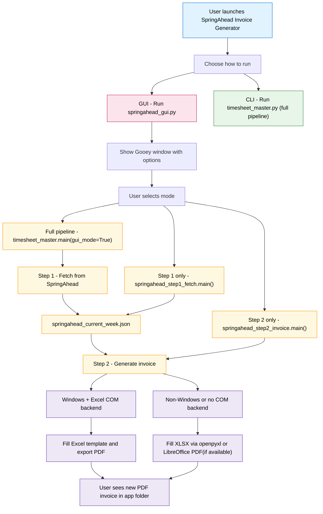

```mermaid
---
config:
  layout: dagre
  theme: mc
---
flowchart TB
    A["User launches SpringAhead Invoice Generator"] --> B["Choose how to run"]
    B --> C["GUI - Run springahead_gui.py"] & D["CLI - Run timesheet_master.py (full pipeline)"]
    C --> E["Show Gooey window with options"]
    E --> F["User selects mode"]
    F --> G["Full pipeline - timesheet_master.main(gui_mode=True)"] & H["Step 1 only - springahead_step1_fetch.main()"] & I["Step 2 only - springahead_step2_invoice.main()"]
    G --> J["Step 1 - Fetch from SpringAhead"]
    J --> K["springahead_current_week.json"]
    K --> L["Step 2 - Generate invoice"]
    H --> K
    I --> L
    L --> M["Windows + Excel COM backend"] & N["Non-Windows or no COM backend"]
    M --> O["Fill Excel template and export PDF"]
    N --> P["Fill XLSX via openpyxl or LibreOffice PDF(if available)"]
    O --> Q["User sees new PDF invoice in app folder"]
    P --> Q

    %% Classes
    classDef start fill:#e0f3ff,stroke:#0066cc,color:#000;
    classDef gui fill:#fce4ec,stroke:#c2185b,color:#000;
    classDef cli fill:#e8f5e9,stroke:#2e7d32,color:#000;
    classDef step fill:#fff8e1,stroke:#ff8f00,color:#000;
    classDef output fill:#ede7f6,stroke:#5e35b1,color:#000;

    class A start;
    class C gui;
    class D cli;
    class G,H,I,J,K,L step;
    class M,N,O,P,Q output;
```
