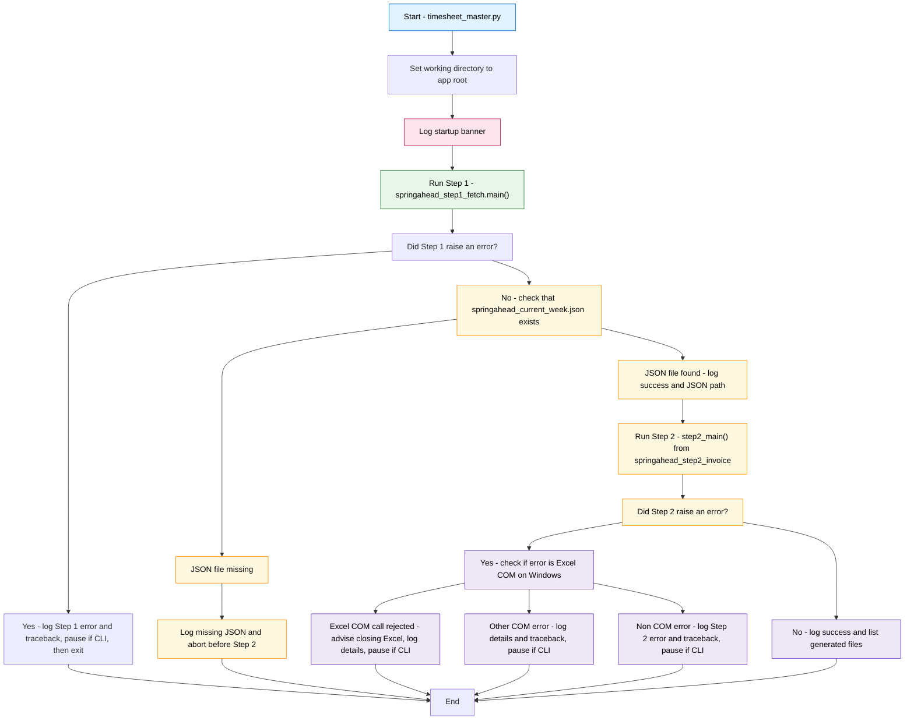

# Full Pipeline - Timesheet Master

```mermaid
flowchart TD
    A["Start - timesheet_master.py"] --> B["Set working directory to app root"]
    B --> C["Log startup banner"]
    C --> D["Run Step 1 - springahead_step1_fetch.main()"]

    D --> E["Did Step 1 raise an error?"]
    E --> F["Yes - log Step 1 error and traceback, pause if CLI, then exit"]
    E --> G["No - check that springahead_current_week.json exists"]

    G --> H["JSON file missing"]
    H --> I["Log missing JSON and abort before Step 2"]

    G --> J["JSON file found - log success and JSON path"]
    J --> K["Run Step 2 - step2_main() from springahead_step2_invoice"]

    K --> L["Did Step 2 raise an error?"]
    L --> M["Yes - check if error is Excel COM on Windows"]
    L --> Q["No - log success and list generated files"]

    M --> N["Excel COM call rejected - advise closing Excel, log details, pause if CLI"]
    M --> O["Other COM error - log details and traceback, pause if CLI"]
    M --> P["Non COM error - log Step 2 error and traceback, pause if CLI"]

    Q --> R["End"]
    N --> R
    O --> R
    P --> R
    F --> R
    I --> R

    %% Classes
    classDef start fill:#e0f3ff,stroke:#0066cc,color:#000;
    classDef gui fill:#fce4ec,stroke:#c2185b,color:#000;
    classDef cli fill:#e8f5e9,stroke:#2e7d32,color:#000;
    classDef step fill:#fff8e1,stroke:#ff8f00,color:#000;
    classDef output fill:#ede7f6,stroke:#5e35b1,color:#000;

    class A start;
    class C gui;
    class D cli;
    class G,H,I,J,K,L step;
    class M,N,O,P,Q output;
```
