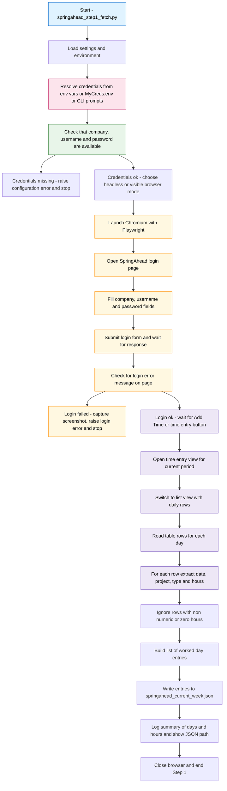

# Step 1 - Fetch

```mermaid
flowchart TD
    A["Start - springahead_step1_fetch.py"] --> B["Load settings and environment"]
    B --> C["Resolve credentials from env vars or MyCreds.env or CLI prompts"]

    C --> D["Check that company, username and password are available"]
    D --> E["Credentials missing - raise configuration error and stop"]
    D --> F["Credentials ok - choose headless or visible browser mode"]

    F --> G["Launch Chromium with Playwright"]
    G --> H["Open SpringAhead login page"]
    H --> I["Fill company, username and password fields"]
    I --> J["Submit login form and wait for response"]

    J --> K["Check for login error message on page"]
    K --> L["Login failed - capture screenshot, raise login error and stop"]
    K --> M["Login ok - wait for Add Time or time entry button"]

    M --> N["Open time entry view for current period"]
    N --> O["Switch to list view with daily rows"]
    O --> P["Read table rows for each day"]

    P --> Q["For each row extract date, project, type and hours"]
    Q --> R["Ignore rows with non numeric or zero hours"]
    R --> S["Build list of worked day entries"]

    S --> T["Write entries to springahead_current_week.json"]
    T --> U["Log summary of days and hours and show JSON path"]
    U --> V["Close browser and end Step 1"]

    %% Classes
    classDef start fill:#e0f3ff,stroke:#0066cc,color:#000;
    classDef gui fill:#fce4ec,stroke:#c2185b,color:#000;
    classDef cli fill:#e8f5e9,stroke:#2e7d32,color:#000;
    classDef step fill:#fff8e1,stroke:#ff8f00,color:#000;
    classDef output fill:#ede7f6,stroke:#5e35b1,color:#000;

    class A start;
    class C gui;
    class D cli;
    class G,H,I,J,K,L step;
    class M,N,O,P,Q output;

```
