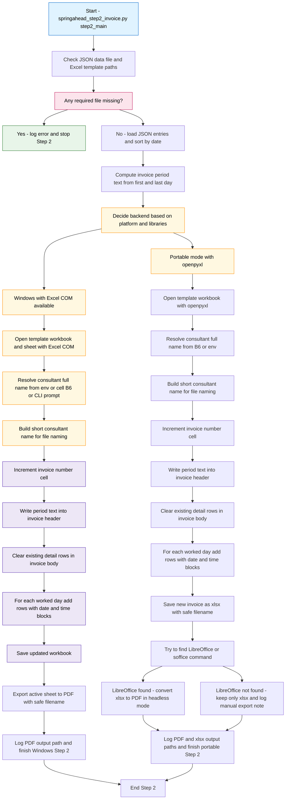

# Step 2 - Invoice

```mermaid
flowchart TD
    A["Start - springahead_step2_invoice.py step2_main"] --> B["Check JSON data file and Excel template paths"]
    B --> C["Any required file missing?"]
    C --> D["Yes - log error and stop Step 2"]
    C --> E["No - load JSON entries and sort by date"]

    E --> F["Compute invoice period text from first and last day"]
    F --> G["Decide backend based on platform and libraries"]

    G --> H["Windows with Excel COM available"]
    G --> I["Portable mode with openpyxl"]

    H --> J["Open template workbook and sheet with Excel COM"]
    J --> K["Resolve consultant full name from env or cell B6 or CLI prompt"]
    K --> L["Build short consultant name for file naming"]
    L --> M["Increment invoice number cell"]
    M --> N["Write period text into invoice header"]
    N --> O["Clear existing detail rows in invoice body"]
    O --> P["For each worked day add rows with date and time blocks"]
    P --> Q["Save updated workbook"]
    Q --> R["Export active sheet to PDF with safe filename"]
    R --> S["Log PDF output path and finish Windows Step 2"]

    I --> T["Open template workbook with openpyxl"]
    T --> U["Resolve consultant full name from B6 or env"]
    U --> V["Build short consultant name for file naming"]
    V --> W["Increment invoice number cell"]
    W --> X["Write period text into invoice header"]
    X --> Y["Clear existing detail rows in invoice body"]
    Y --> Z["For each worked day add rows with date and time blocks"]
    Z --> AA["Save new invoice as xlsx with safe filename"]
    AA --> AB["Try to find LibreOffice or soffice command"]
    AB --> AC["LibreOffice found - convert xlsx to PDF in headless mode"]
    AB --> AD["LibreOffice not found - keep only xlsx and log manual export note"]
    AC --> AE["Log PDF and xlsx output paths and finish portable Step 2"]
    AD --> AE
    S --> AF["End Step 2"]
    AE --> AF

    %% Classes
    classDef start fill:#e0f3ff,stroke:#0066cc,color:#000;
    classDef gui fill:#fce4ec,stroke:#c2185b,color:#000;
    classDef cli fill:#e8f5e9,stroke:#2e7d32,color:#000;
    classDef step fill:#fff8e1,stroke:#ff8f00,color:#000;
    classDef output fill:#ede7f6,stroke:#5e35b1,color:#000;

    class A start;
    class C gui;
    class D cli;
    class G,H,I,J,K,L step;
    class M,N,O,P,Q output;
```
