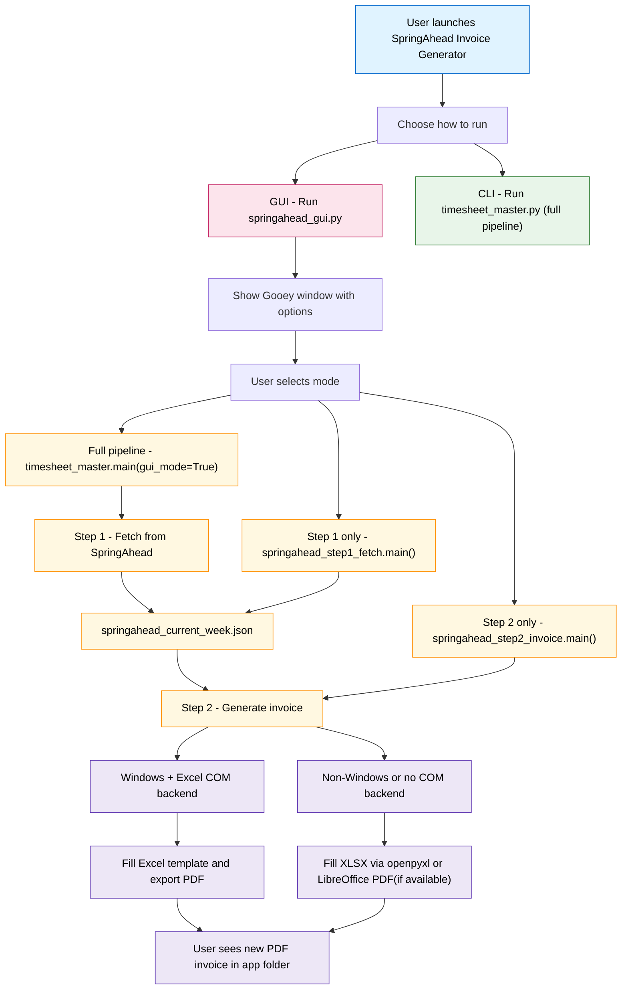
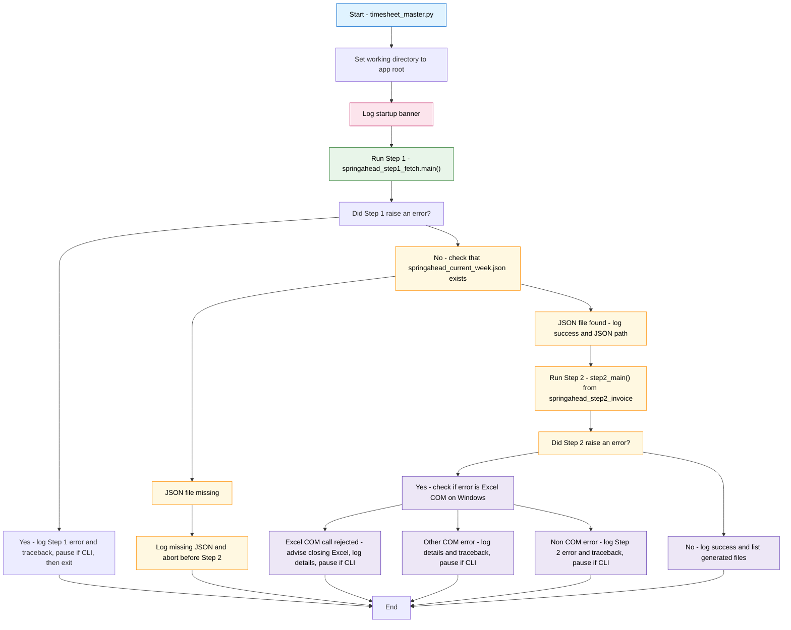
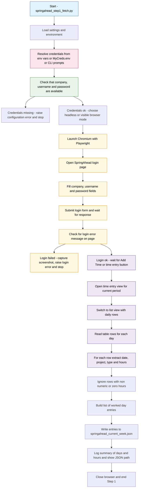
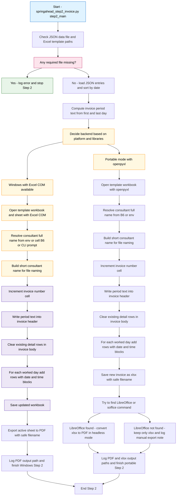

# Main Flowchart

```mermaid
---
config:
  layout: dagre
  theme: mc
---
flowchart TB
    A["User launches SpringAhead Invoice Generator"] --> B["Choose how to run"]
    B --> C["GUI - Run springahead_gui.py"] & D["CLI - Run timesheet_master.py (full pipeline)"]
    C --> E["Show Gooey window with options"]
    E --> F["User selects mode"]
    F --> G["Full pipeline - timesheet_master.main(gui_mode=True)"] & H["Step 1 only - springahead_step1_fetch.main()"] & I["Step 2 only - springahead_step2_invoice.main()"]
    G --> J["Step 1 - Fetch from SpringAhead"]
    J --> K["springahead_current_week.json"]
    K --> L["Step 2 - Generate invoice"]
    H --> K
    I --> L
    L --> M["Windows + Excel COM backend"] & N["Non-Windows or no COM backend"]
    M --> O["Fill Excel template and export PDF"]
    N --> P["Fill XLSX via openpyxl or LibreOffice PDF(if available)"]
    O --> Q["User sees new PDF invoice in app folder"]
    P --> Q

    %% Classes
    classDef start fill:#e0f3ff,stroke:#0066cc,color:#000;
    classDef gui fill:#fce4ec,stroke:#c2185b,color:#000;
    classDef cli fill:#e8f5e9,stroke:#2e7d32,color:#000;
    classDef step fill:#fff8e1,stroke:#ff8f00,color:#000;
    classDef output fill:#ede7f6,stroke:#5e35b1,color:#000;

    class A start;
    class C gui;
    class D cli;
    class G,H,I,J,K,L step;
    class M,N,O,P,Q output;
```
---
# Full Pipeline - Timesheet Master

```mermaid
flowchart TD
    A["Start - timesheet_master.py"] --> B["Set working directory to app root"]
    B --> C["Log startup banner"]
    C --> D["Run Step 1 - springahead_step1_fetch.main()"]

    D --> E["Did Step 1 raise an error?"]
    E --> F["Yes - log Step 1 error and traceback, pause if CLI, then exit"]
    E --> G["No - check that springahead_current_week.json exists"]

    G --> H["JSON file missing"]
    H --> I["Log missing JSON and abort before Step 2"]

    G --> J["JSON file found - log success and JSON path"]
    J --> K["Run Step 2 - step2_main() from springahead_step2_invoice"]

    K --> L["Did Step 2 raise an error?"]
    L --> M["Yes - check if error is Excel COM on Windows"]
    L --> Q["No - log success and list generated files"]

    M --> N["Excel COM call rejected - advise closing Excel, log details, pause if CLI"]
    M --> O["Other COM error - log details and traceback, pause if CLI"]
    M --> P["Non COM error - log Step 2 error and traceback, pause if CLI"]

    Q --> R["End"]
    N --> R
    O --> R
    P --> R
    F --> R
    I --> R

    %% Classes
    classDef start fill:#e0f3ff,stroke:#0066cc,color:#000;
    classDef gui fill:#fce4ec,stroke:#c2185b,color:#000;
    classDef cli fill:#e8f5e9,stroke:#2e7d32,color:#000;
    classDef step fill:#fff8e1,stroke:#ff8f00,color:#000;
    classDef output fill:#ede7f6,stroke:#5e35b1,color:#000;

    class A start;
    class C gui;
    class D cli;
    class G,H,I,J,K,L step;
    class M,N,O,P,Q output;
```
---
# Step 1 - Fetch

```mermaid
flowchart TD
    A["Start - springahead_step1_fetch.py"] --> B["Load settings and environment"]
    B --> C["Resolve credentials from env vars or MyCreds.env or CLI prompts"]

    C --> D["Check that company, username and password are available"]
    D --> E["Credentials missing - raise configuration error and stop"]
    D --> F["Credentials ok - choose headless or visible browser mode"]

    F --> G["Launch Chromium with Playwright"]
    G --> H["Open SpringAhead login page"]
    H --> I["Fill company, username and password fields"]
    I --> J["Submit login form and wait for response"]

    J --> K["Check for login error message on page"]
    K --> L["Login failed - capture screenshot, raise login error and stop"]
    K --> M["Login ok - wait for Add Time or time entry button"]

    M --> N["Open time entry view for current period"]
    N --> O["Switch to list view with daily rows"]
    O --> P["Read table rows for each day"]

    P --> Q["For each row extract date, project, type and hours"]
    Q --> R["Ignore rows with non numeric or zero hours"]
    R --> S["Build list of worked day entries"]

    S --> T["Write entries to springahead_current_week.json"]
    T --> U["Log summary of days and hours and show JSON path"]
    U --> V["Close browser and end Step 1"]

    %% Classes
    classDef start fill:#e0f3ff,stroke:#0066cc,color:#000;
    classDef gui fill:#fce4ec,stroke:#c2185b,color:#000;
    classDef cli fill:#e8f5e9,stroke:#2e7d32,color:#000;
    classDef step fill:#fff8e1,stroke:#ff8f00,color:#000;
    classDef output fill:#ede7f6,stroke:#5e35b1,color:#000;

    class A start;
    class C gui;
    class D cli;
    class G,H,I,J,K,L step;
    class M,N,O,P,Q output;

```
---
# Step 2 - Invoice

```mermaid
flowchart TD
    A["Start - springahead_step2_invoice.py step2_main"] --> B["Check JSON data file and Excel template paths"]
    B --> C["Any required file missing?"]
    C --> D["Yes - log error and stop Step 2"]
    C --> E["No - load JSON entries and sort by date"]

    E --> F["Compute invoice period text from first and last day"]
    F --> G["Decide backend based on platform and libraries"]

    G --> H["Windows with Excel COM available"]
    G --> I["Portable mode with openpyxl"]

    H --> J["Open template workbook and sheet with Excel COM"]
    J --> K["Resolve consultant full name from env or cell B6 or CLI prompt"]
    K --> L["Build short consultant name for file naming"]
    L --> M["Increment invoice number cell"]
    M --> N["Write period text into invoice header"]
    N --> O["Clear existing detail rows in invoice body"]
    O --> P["For each worked day add rows with date and time blocks"]
    P --> Q["Save updated workbook"]
    Q --> R["Export active sheet to PDF with safe filename"]
    R --> S["Log PDF output path and finish Windows Step 2"]

    I --> T["Open template workbook with openpyxl"]
    T --> U["Resolve consultant full name from B6 or env"]
    U --> V["Build short consultant name for file naming"]
    V --> W["Increment invoice number cell"]
    W --> X["Write period text into invoice header"]
    X --> Y["Clear existing detail rows in invoice body"]
    Y --> Z["For each worked day add rows with date and time blocks"]
    Z --> AA["Save new invoice as xlsx with safe filename"]
    AA --> AB["Try to find LibreOffice or soffice command"]
    AB --> AC["LibreOffice found - convert xlsx to PDF in headless mode"]
    AB --> AD["LibreOffice not found - keep only xlsx and log manual export note"]
    AC --> AE["Log PDF and xlsx output paths and finish portable Step 2"]
    AD --> AE
    S --> AF["End Step 2"]
    AE --> AF

    %% Classes
    classDef start fill:#e0f3ff,stroke:#0066cc,color:#000;
    classDef gui fill:#fce4ec,stroke:#c2185b,color:#000;
    classDef cli fill:#e8f5e9,stroke:#2e7d32,color:#000;
    classDef step fill:#fff8e1,stroke:#ff8f00,color:#000;
    classDef output fill:#ede7f6,stroke:#5e35b1,color:#000;

    class A start;
    class C gui;
    class D cli;
    class G,H,I,J,K,L step;
    class M,N,O,P,Q output;
```
